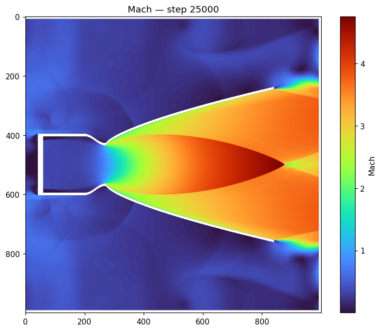
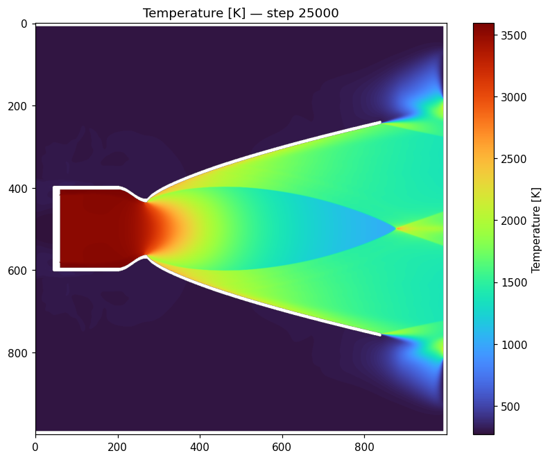
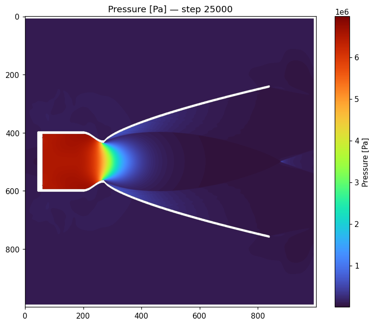

<h1 align="center">Tachyon CFD</h1>
<p align="center"><b>Beta 0.1</b> · GPU-accelerated compressible RANS solver for rocket-engine nozzles</p>

<p align="center">
  
</p>
<p align="center"><i>Rocketdyne F-1 at sea level — Mach field with the over-expanded shock diamonds in the plume.</i></p>

Draw your engine as a PNG or SVG (or in the built-in vector designer), set the
chamber conditions, press **Run**, and get thrust, Isp, full flow fields, wall
heat flux and a PDF report — all computed on the GPU in seconds-to-minutes.

Validated against the Rocketdyne F-1: **thrust within ~0.2 %**, and Isp
bracketed within ±3.5 % by the included gas models
(see [docs/VALIDATION.md](docs/VALIDATION.md)).

> New here? The whole control panel is documented field-by-field in
> **[docs/USER_GUIDE.md](docs/USER_GUIDE.md)**.

---

## Highlights

- **Runs on the GPU** — custom CUDA kernels via CuPy (float32); ~100 steps/s on
  a 1M-cell grid on a GTX 1060.
- **Smooth cut-cell meshing** — your drawing becomes a sub-pixel embedded
  boundary (level-set apertures + volume fractions), so curved contours behave
  like real surfaces, not pixel staircases. Axisymmetric meshes are guaranteed
  exactly symmetric about the centerline.
- **Three gas models** — calorically perfect (constant γ), thermally perfect
  (cp(T) of the frozen chamber mixture), and **shifting equilibrium** with a
  built-in mini-CEA (chamber equilibrium, recombination chemistry, GPU property
  tables per propellant).
- **10 propellant presets** with NASA-CEA chamber properties — LOX/RP-1,
  LOX/CH₄ (methalox), LOX/LH₂, LOX/Ethanol, MMH/NTO, UDMH/N₂O₄, N₂O/HTPB
  (hybrid), H₂O₂/RP-1, plus air and steam (or fully custom).
- **Real-engine knobs** — combustion efficiency η_c\*, isothermal walls with
  in-solver convective **and radiative** wall heat flux (cross-checked against
  the Bartz correlation within ~3 %), and two-gamma plume/air mixing.
- **Modern numerics** — HLLC / HLL / Roe / AUSM+ fluxes, MUSCL (minmod · van
  Albada · van Leer · superbee) and **WENO5** reconstruction, k-ω SST
  turbulence, a Ducros-gated carbuncle cure, and an optional compressibility
  correction.
- **Analysis tools** — two-click line probe (centerline / wall-pressure
  presets), altitude sweep (thrust & Isp vs altitude, aerospike comparisons),
  convergence gate, multi-page PDF report, MP4 export, 3D exhaust view, and a
  vector **engine designer** tab.
- **Five GUI themes** — Mono (B&W, default), Claude Light/Dark, Blueprint, and
  Midnight.

## Gallery

<p align="center">
  
  
</p>
<p align="center"><i>F-1 temperature (left) and pressure (right). More cases and accuracy numbers in <a href="docs/VALIDATION.md">VALIDATION.md</a>.</i></p>

## Install (from source)

Requires an NVIDIA GPU with a CUDA 12.x driver and Python 3.11+.

```
pip install -r requirements.txt
pip install nvidia-cuda-nvrtc-cu12 nvidia-cuda-runtime-cu12
python run_gui.py
```

The two `nvidia-*` wheels provide the runtime CUDA compiler (NVRTC) and headers
— no full CUDA Toolkit install needed. The "CUDA path could not be detected"
warning at startup is benign.

Headless runs: `python -m rocketcfd.headless engine.png --config cfg.json
--steps 20000`. Altitude sweep CLI: `python -m rocketcfd.sweep`.

## Windows EXE

A standalone build (no Python required):

```
pyinstaller packaging\RocketCFD.spec --noconfirm
dist\TachyonCFD\TachyonCFD.exe --selftest    # verify the GPU pipeline
iscc packaging\tachyon_installer.iss         # build the installer (Inno Setup)
```

## Input format

A PNG (1 pixel = 1 finite-volume cell) or an SVG (rasterized automatically):

| Color | Meaning |
|-------|---------|
| **black** | wall |
| **white** | flow space |
| **blue**  | pressure inlet (chamber total conditions p₀, T₀) |
| **red**   | pressure outlet (absorbs waves at ambient pressure) |

Image edges act as farfield boundaries; draw red strips along the borders to
absorb startup shocks. Physical scale is set by *meters per pixel*; *mesh
density* refines the grid without changing the drawing. Keep walls ≥ 4 px thick,
and toggle **Axisymmetric** for round engines (axis through the image center, or
a top/bottom edge if you drew a half-model).

## Physics & numerics

- Compressible RANS, finite volume, SSP-RK2 with local time stepping
- Fluxes: HLLC (default), HLL, Roe, AUSM+; MUSCL 2nd order (4 limiters) or WENO5
- k-ω SST turbulence (Menter), wall-distance based, point-implicit sources
- Gas models: constant γ / cp(T) frozen mixture (JANAF) / shifting equilibrium
  (Gibbs minimization, tabulated for the GPU; chemistry frozen below ~900 K)
- Walls: slip, or no-slip with Reichardt wall functions; optional isothermal
  wall with Kader convective heat flux + gray-gas radiation
- Axisymmetric source terms, Sutherland viscosity, inlet soft-start

The measured accuracy envelope and solver biases are documented honestly in
[docs/VALIDATION.md](docs/VALIDATION.md); the realism roadmap and completed
tiers are in [docs/REALISM.md](docs/REALISM.md).

## Tests

Plain-script tests in `tests/` (GPU required for most):

```
python tests\test_isentropic.py        # choked flow vs theory
python tests\test_thermo_gas.py        # gas models
python tests\test_equilibrium_gas.py   # equilibrium mode
python tests\test_wall_functions.py    # wall functions + heat flux
python tests\test_radiation.py         # flux schemes + radiative wall flux
python tests\test_report.py            # end-to-end PDF report
```

## Status

Beta 0.1 — actively developed. Built for (and used by) members of the Austrian
Space Team. Issues and PRs welcome.

## License

MIT — see [LICENSE](LICENSE).
